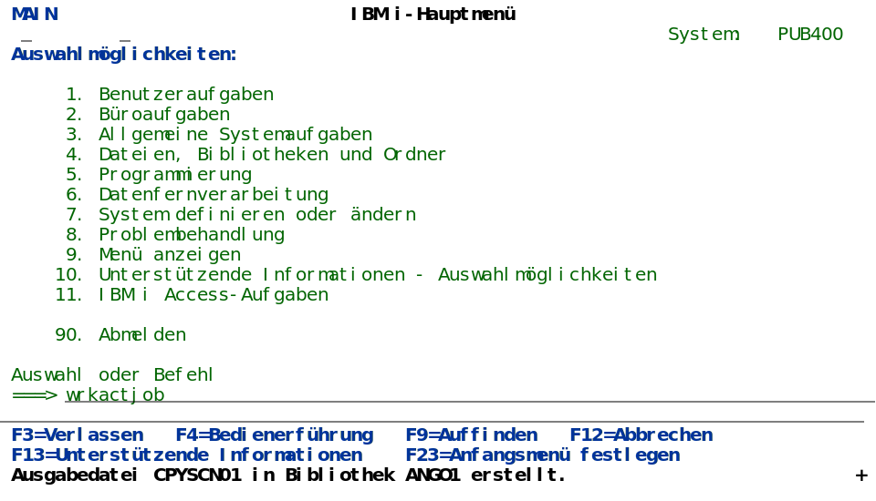
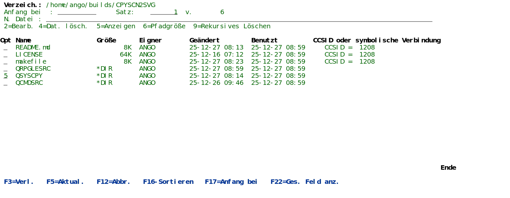

# CPYSCN2SVG

Convert the output of IBM i command STRCPYSCN to svg files in the IFS.

## Usage

Create a file with "screenshots" with the IBM i command STRCPYSCN.

Now do in this session what you want to document.

The typical use cases are:

* screenshots to document how to use a 5250 program
* screenshots to document how to recreate an error

Every screen you see now is written to the table you stated on the STRCPYSCN command.

When you're ready, use command ENDCPYSCN to end copying screens to the table.

Use command CPYSCN2SVG from this repo to convert the database records to svg files in an IFS directory of your choice.

The created svg files can be used

* online in html or markdown pages (like this one)
* in documents (Word, Excel, ...)
* in mails
* and many more

### Why do i not use ACS screenshots?

To make documents like user manuals look consistent, all users creating screenshots would have to use the same color settings. Which is rather hard to achieve in real life.

They are quite big in file size, although they contain mainly letters and minimal graphics.

Resizing these screenshots can be a nightmare on it's own.

### known issues

* As the screenshots created by STRCPYSCN contain only character data, subfile bars and other graphical enhancements (some emulators can be set to display function buttons as real clickable buttons) are not recreated. (Although logic could be added to draw boxes around function keys, I don't see a solution for the other things.)

* water marks aren't included. Svg could be used to create powerful watermarks; but in most use cases, these would be annoying, so i didn't include any logic for that.

### further ideas

* [ ] parameters for from and to record in the outfile created by STRCPYSCN
* [ ] Search/replace to change system / user names to other values
* [ ] exit programs for further manipulations

## svg

The created svg files can use any font as every character is positioned on the "screen", so it hasn't to be a monospace font, where every character has the same width, but i'd recommend using one.

As all svg commands have classes, the appearance can be changed via CSS (Cascading Style Sheets).

You can select whether CPYSCN2SVG shall

* create inline svg (the default)
* create a separate css-file and refer to this file in the svg-files
* add up to 5 additional css files in the svg files

A traditional 5250 session uses green characters on a black background.

Although "dark mode" is now in fashion (Ha! We knew we were right all the time!) nobody will print green on black on paper, as it is hard to read and costs a lot of ink / toner. But what do i know.

So i assume these svg files will be used mainly on a white background. So i had to change colors, as DSPATR(HI) results in white on a 5250 color screen and that would be invisible on a white background.

The mapping is done in CSS; so you could use the same svg files in dark mode on one html page, and in light mode on another. To make this work, use relative paths for the css file or embed the style in the html file(s).

## Samples

MAIN menu of <https://pub400.com> (24 lines x 80 characters)


DSPF (27 lines x 132 characters)


## how to create

Download the repo to your IBM i, e.g. to /OSS/CPYSCN2SVG.

In a bash shell, make this directory your current directory and run "make" to compile the source code. You can and should override the OBJLIB to create the command and the program in a library of your choice.

```bash
cd /OSS/CPYSCN2SVG
make OBJLIB=MYLIB
```

If you don't have bash and gnu make installed, your can run the compile commands manually:

```cl
CRTCMD CMD(MYLIB/CPYSCN2SVG) PGM(MYLIB/CPYSCN2SVG) SRCSTMF('QCMDSRC/CPYSCN2SVG.CMD') PRDLIB(MYLIB)

CRTSQLRPGI OBJ(MYLIB/CPYSCN2SVG) SRCSTMF('QRPGLESRC/CPYSCN2SVG.SQLRPGLE') INCDIR('./') RPGPPOPT(*LVL2) COMPILEOPT('TGTCCSID(*JOB)') DBGVIEW(*LIST)
```

## how to use

Start "recording" all your screens to a database file with command STRCPYSCN.

```cl
STRCPYSCN SRCDEV(*REQUESTER)     
          OUTDEV(*NONE)          
          OUTFILE(MYLIB/MYSCNCPY)
```

Answer the message "Cause . . . . . :   Start copy screen has been requested with output to *NONE. Reply C to prevent copy screen or G to allow it. (C G)" with "G".

Now all your screens are recorded to the database file MYLIB/MYSCNCPY. (So don't type anything that shouldn't be visible to others.)

When you're done, end the recording with command ENDCPYSCN.

```cl
ENDCPYSCN
```

Wait for the message "Copy Screen Image from YOURSCREEN has ended."

```cl
CPYSCN2SVG FILE(MYLIB/MYSCNCPY)
           PATH(myscncpy)     
           PREFIX(screen)    
           INCDATE(*NO)        
           INCTIME(*NO)        
           INCCNT(3)           
           INCSEP('-')         
           OUTPUT(*HTML *MD)   
```

This will create svg files in the IFS directory "myscncpy" (will be created, if it doesn't exist) with names like screen-001.svg, screen-002.svg, ...

### File name parameters

You can choose to include the creation date and time, that is stored in the database file by STRCPYSCN, in the file names.
You can also include a counter in the file names.

### HTML

OUTPUT(*HTML) will create a html file with embedding  tags for all created svg files.

It contains also a simple css style to display the svg files with a border.

### Markdown

OUTPUT(*MD) will create a markdown file with embedding &excl;&#91;&#93;() tags for all created svg files. (Like in this README.md above.)

### CSS

By default, all style information is included in the svg files (*INLINE).
This is the recommended setting for most use cases, as the embedded css will be respected everywhere.

You can choose to create a separate css file by specifying it's path/name and have the svg files refer to this file. But bear in mind, that this will work only when you display the svg file on it's own; if you embed it in an html or markdown file, the css file won't be loaded!

You can also include up to 5 additional css files in the svg files.
